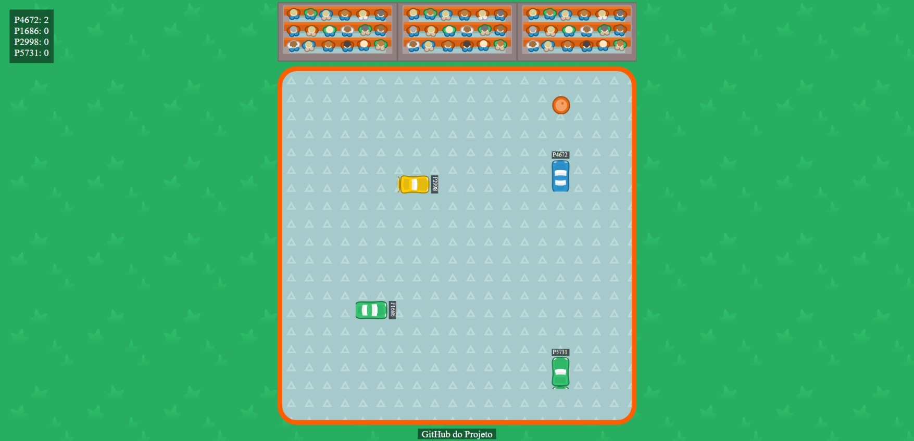

# Point Racer Multiplayer



**Point Racer Multiplayer** é um jogo de corrida multiplayer simples, onde o objetivo é capturar o máximo de pontos possível através de barris de gasolina vermelhos.

## Sobre o Projeto

Este projeto foi desenvolvido para aprimorar o conhecimento em comunicação bidirecional entre servidor e cliente, permitindo a conexão de múltiplos usuários simultaneamente e a troca de informações sobre posições e pontuações em tempo real.

## Tecnologias Utilizadas

- **Servidor:** PHP com Ratchet
- **Cliente:** JavaScript, HTML e CSS

## Como Jogar

1. **Clone o repositório:**
   ```bash
   git clone https://github.com/CarlosEduts/point-racer-multiplayer
   ```

2. **Instale as dependências:**
   ```bash
   composer install
   ```

3. **Execute o servidor:**
   ```bash
   php server.php
   ```

4. **Abra o arquivo `index.html` no seu navegador.**

---

**Créditos:** Os assets utilizados no jogo foram obtidos de [Kenney](https://kenney.nl/assets).